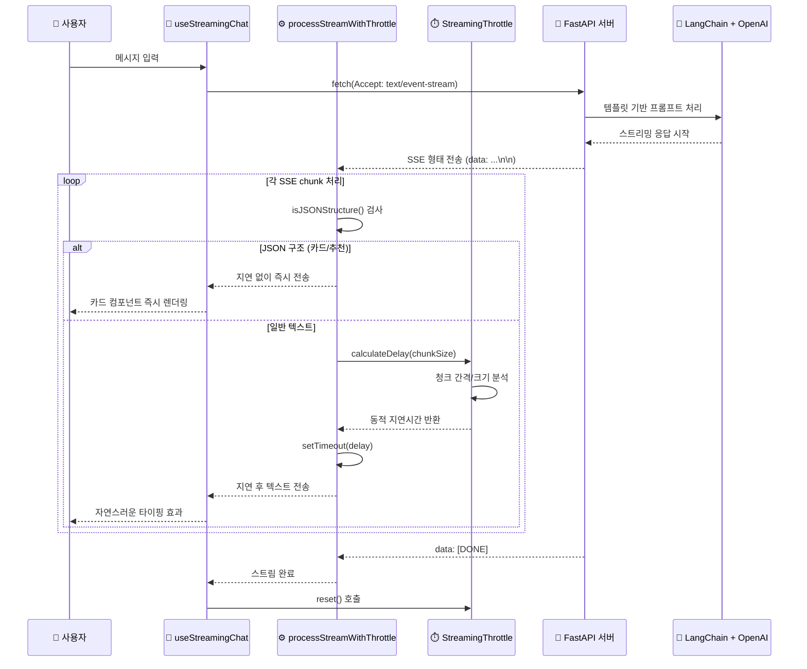

# ✨ MoonoZ

## MZ세대를 위한 스마트한 U+ 혜택 큐레이션 서비스

**경기 불황 속에서 합리적 소비를 추구하는 MZ세대를 위한**  
**AI 기반 LG U+ 요금제 및 구독 서비스 추천 플랫폼**

[WBS](https://docs.google.com/spreadsheets/d/1ln5VudFdBKMbaNANwzZyW0CGLYC_R9Xf/edit?usp=sharing&ouid=101077923369398316818&rtpof=true&sd=true) • [플로우 차트](https://www.figma.com/proto/C1HjN8qg3Vptm2j7k2cT8N/%ED%94%8C%EB%A1%9C%EC%9A%B0%EC%B0%A8%ED%8A%B8?node-id=1-4&t=OH4mgwF8RPp4bDv8-1&scaling=scale-down-width&content-scaling=fixed&page-id=0%3A1) • [API 명세서](https://hollow-cello-87b.notion.site/1fb3347f51ee81269bceeaad7f3c76f1?v=1fb3347f51ee81719ba1000c67dfe978) • [ERD](https://dbdiagram.io/d/DB_4ever0-684e577c3cc77757c8eaba7c) • [Storybook](https://6835efb2a0dda6635d6b2c1d-nazyzhfott.chromatic.com)

## 프로젝트 개요

| 항목           | 내용                             |
| -------------- | -------------------------------- |
| **프로젝트명** | MoonoZ                           |
| **팀명**       | 4EVER0                           |
| **주제**       | LG U+ 요금제 추천 AI 챗봇 서비스 |
| **타겟층**     | 합리적 소비를 추구하는 MZ세대    |
| **개발 기간**  | 2025.06.04 ~ 2025.06.26 (약 3주) |
| **팀 구성**    | Frontend 5명 (Full-Stack 개발)   |

### 개발 동기

- **시장 배경**
  - 최근 경기 불황과 구독료 인상으로 **MZ세대의 합리적 소비 지향**이 뚜렷해짐
  - 최근 LG유플러스의 '유독픽' 과 같은 구독 통합 상품이 **20·30대 가입자 비중 71%** 달성
  - **개인 라이프스타일 최적화된 통합 서비스**에 대한 수요 급증
- **개발 목표**
  - **AI 챗봇 기반 성향 분석**을 통한 맞춤형 요금제 및 서비스 추천
  - **MZ세대의 스마트한 통신 라이프스타일** 지원

## 주요 기능

### **1. AI 기반 멀티턴 챗봇 & 요금제 추천**

- **LangChain + OpenAI 템플릿 아키텍처**: 자연어 처리로 사용자 성향과 패턴 분석해 LG U+ 요금제 및 구독 서비스 맞춤 추천
- **멀티턴 세션 관리**: Redis 기반 대화 상태 보존, 세션 마이그레이션 및 플로우 자동 전환
- **StreamingThrottle 프로세서**: 청크별 지연 제어로 실제 사람 대화 패턴 모방 구현
- **`useStreamingChat` 커스텀 훅**: JSON/텍스트 혼합 메시지 처리 및 실시간 카드 렌더링 지원

### **2. 위치 기반 혜택 추천 & 스토어맵**

- **Naver Geolocation + Maps API**: 사용자 위치 감지 및 Reverse Geocoding으로 주소 추출
- **Google Search 기반 스토어맵**: 좋아요한 브랜드의 오프라인 매장 정보 제공 및 반경 내 혜택 추천
- **브랜드 선호도 알고리즘**: 좋아요한 쿠폰의 브랜드 기반 유독픽 서비스 추천

### **3. 소셜 로그인 & 보안 인증 시스템**

- **OAuth2 통합 인증**: Kakao/Google/Naver 로그인 지원, JWT는 HttpOnly Cookie로 관리
- **Redis 세션 관리**: Refresh Token 저장 및 userId/authId는 Zustand + localStorage 동기화
- **Axios 인터셉터**: 401 응답 시 자동 refresh 요청 후 재시도 처리 구현
- **하이브리드 인증**: 서버 기반 인증 + 프론트엔드 상태 동기화 및 리프레시 트리거 분리

## 팀원 소개

|                                                           [이영주](https://github.com/abyss-s)                                                            |                                                                  [박교녕](https://github.com/kny0ng125)                                                                   |                                                           [박지회](https://github.com/jihoi0615)                                                            |                                                                [이은채](https://github.com/eunchrri)                                                                 |                                                                   [홍민주](https://github.com/illustermin)                                                                   |
| :-------------------------------------------------------------------------------------------------------------------------------------------------------: | :-----------------------------------------------------------------------------------------------------------------------------------------------------------------------: | :---------------------------------------------------------------------------------------------------------------------------------------------------------: | :------------------------------------------------------------------------------------------------------------------------------------------------------------------: | :--------------------------------------------------------------------------------------------------------------------------------------------------------------------------: |
|                                                                             |                                                                                             |                                                                              |                                                                                       |                                                                                               |
| **팀장**, AI 챗봇 설계 및 스트리밍 처리 요금제·구독 API 개발 Naver API 연동 스토리북 관리 모달 전역 상태 관리 설계 요금제 페이지 개선 | OAuth 로그인 및 콜백 구현 JWT 인증·전역 상태 관리 Google/Naver API 매장 탐색 기능 개발 SNS 공유 기능 추가 마이페이지·핫플 UI 구현 인프라 및 배포 관리 | 플로우 차트 작성 쿠폰·팝업스토어·유플투쁠 ERD 설계 좋아요·BEST 3 혜택 API 개발 핫플·타코시그널 UI 구현 공통 컴포넌트 제작 코드 리팩토링 | 미션·출석 기능 ERD 설계 미션·출석·유플투쁠 API 구현 UI 기획 및 캘린더 컴포넌트 제작 월별 출석 조회 API 추가 달력 상태 렌더링 구현 관련 코드 정리 | 마이페이지·쿠폰함·타코시그널 UI 기획 쿠폰 전체·발급·사용 API 개발 요금제 카드 컴포넌트 제작 홈·마이페이지·랜딩 UI 구현 공통 컴포넌트 개발 오류 코드 정리 |

## 기술 스택

| 분야                  | 기술 스택                                                                                                                                                                                                                                                                                                                                                                                                                                                                                                                                                                                                                                                                                                  |
| --------------------- | ---------------------------------------------------------------------------------------------------------------------------------------------------------------------------------------------------------------------------------------------------------------------------------------------------------------------------------------------------------------------------------------------------------------------------------------------------------------------------------------------------------------------------------------------------------------------------------------------------------------------------------------------------------------------------------------------------------- |
| **Frontend**          |        |
| **Backend**           |                         |
| **AI Server**         |                                                                                                                                                                                                                                                                                                    |
| **Infrastructure**    |                                                                                                                                                                                                                 |
| **Development Tools** |                                           |
| **UI/UX & Testing**   |                                                                                                                                                                                                          |

## 시스템 아키텍처

## AI 챗봇 동적 스트리밍 제어 아키텍처

